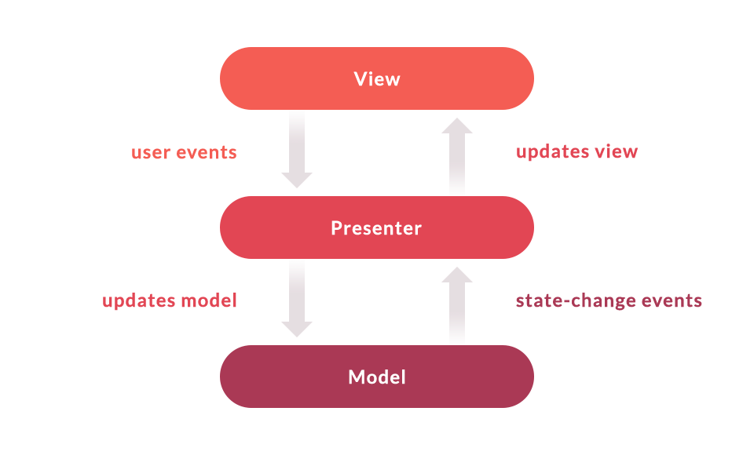

# MoneyMe
-  Created a react-native expo application that fetches data from itunes api

## Approach Prioritization
- We have started with the functional part first
   - Splash Screen
   - Intro Screen (Add-ons)
   - Home Screen
   - HomeDetail Screen
   - Animations
   - Unit test cases

## Features
- Application launcher icon
    - We have used MoneyMe application's official launcher icon
- Splash screen
    - We have used MoneyMe application's official logo in splash screen to make it better
- Intro Screen
    - We have additionally added this screen to make users aware about concept of our application
- Home Screen
    - We have made user friendly design of home screen
    - Users can search their favourite artist by typing artist name or search field and according to that list will be displayed
    - Users can find list according to album name and release date
- Detail Screen
    - We have displayed detail of selected album  
- Animations 
    - Animation deepens visual understanding much more than traditional diagrams.
    - Animation omits unnecessary verbiage and visuals and allows you to communicate ideas quickly.   
    - We have added animation on all the pages of app to make application attractive.
    - We have added FadeIn animation on Splash screen
    - We have added Spring animation on Intro screen
    - We have added FadeOut animation on Home Screen
    - We have added FadeIn and Scale Interpolate animation on Home Detail Screen
- Test Cases
    - We have written Jest unit test cases for testing pages of application
    - On Splash Screen we have written two test cases 
       - To check whether application crashes on splash screen or not
       - We have written test case to verify that splash screen will be visible to user until 5 seconds and after that user is  
         navigating to the intro screen
       - also we have added snapshot code to get snapshot of testing
  - On Intro Screen we have written two test cases 
       - To check whether application crashes on intro screen or not
       - We have written test cases to verify that on pressing of next arrow button user is navigating to home page or not
  - On Home screen we have written two test cases
       - If user search albumname then list shouild be updated according to particular albumname
       - If user selects album name then list should be updated according to album name filter,after that if user click on card then user should navigated           to next screen.
       - If user selects release date then list should be updated according to release date filter,after that if user click on card then user should                 navigated to next screen.
  -  On Home detail screen we have written one test case
      - If user click on back arrow then user should navigate to the previous screen.

<p align="center">
  
</p>

## Package Structure
```
com.money.me
moneyme/
├─ __test__/
│  ├─ App.test.tsx
├─ src/
│  ├─ components/
│  │  ├─ button/
│  │  │  ├─ Button.tsx
│  ├─ constants/
│  │  ├─ Color.tsx
│  ├─ navigators/
│  │  ├─ Index.tsx
│  ├─ network/
│  │  ├─ ApiCall.tsx
│  ├─ redux/
│  │  ├─ general_reducer/
│  │  ├─ Index.tsx
│  │  ├─ Store.tsx
│  ├─ Screens/
│  │  ├─ home/
│  │  │  ├─ home_redux/
│  │  │  │  ├─ home_reducer/
├─ assets/
│  ├─ images/
│  │  ├─ test.png
│  ├─ fonts/
│  │  ├─ roboto.ttf
│  ├─ Index.tsx
├─ node_modules/
│  ├─ index.css
├─ .gitignore
├─ package.json
├─ App.tsx
├─ App.json
├─ README.md
```

## Tech components
- **React-Native**
   - Code Reusability. The biggest advantage of React Native is that developers don't need to create separate codes for different platforms (Android and iOS).
- **Expo** 
  We have used Expo for 
   - To download application smoothly.
   - The Fastest Way To Build React Native Apps.
   - Publish Over The Air (OTA) Updates Instantly.
   - Integrated Access To The Native API.
   - Not All iOS And Android APIs Are Available.
   - Build's Production May Be Delayed.
- **TypeScript**
  - TypeScript Code is converted into Plain JavaScript Code: TypeScript code can’t be natively interpreted by browsers. So if the code was written in TypeScript, it gets compiled and converted into JavaScript. This process is known as Trans-piled. With the help of JavaScript code, browsers are able to read the code and display it.
   - JavaScript is TypeScript: Whatever code is written in JavaScript can be converted to TypeScript by changing the extension from .js to .ts.
   - Use TypeScript anywhere: TypeScript can be compiled to run on any browser, device, or operating system. TypeScript is not specific to any single environment.
   - TypeScript supports JS libraries: With TypeScript, developers can use already existing JavaScript code, incorporate popular JavaScript libraries, or call the TS Code from native JavaScript code.
- **Axios**
  - Axios has the ability to intercept HTTP requests. Fetch, by default, doesn't provide a way to intercept requests. Axios has built-in support for download progress. Fetch does not support upload progress.
- **React-Native Navigation**
  - React Navigation is one of the most widely used and actively developed libraries out there on the scene. It is also one of the solutions recommended by the React Native team. It’s the community solution being most pushed by Facebook.
- **Redux**
   <p align="center">
  
</p>
  - Increases the Predictability of a State. In the Redux library, a state is invariably predictable.
  - It is Highly Maintainable.
  - It Prevents Re-renders.
  - Redux Optimizes Performance.
  - Makes Debugging Easier.
  - Useful in Server-Side Rendering. 
  - Provides Ease of Testing.
- **LifeCycle Component**
  - Hooks
  - Functional Components
- **Unit Testing**
  - Jest Framework
  - Offers a CLI tool to control your tests easily
  - Comes with an interactive mode that automatically runs all affected tests for the code changes you’ve made in your last commit
  - Provides syntax to test a single test or skip tests with .only and .skip. This feature is useful when debugging individual 
    tests  
- **Animations**
  - The Animated (default feature of react-native) is designed to make animations fluid, powerful, and painless to build and maintain. Animated focuses on declarative relationships between inputs and outputs, configurable transforms in between, and start/stop methods to control time-based animation execution.

## Architecture
**MVP**

<p align="center">
  
</p>
 
MVP architecture pattern provides an easy way to structure the project codes. The reason why MVP is widely accepted is that it provides modularity, testability, and a more clean and maintainable codebase.


